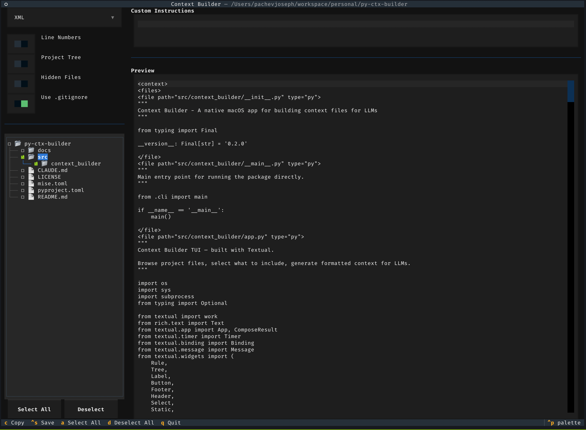

# Context Builder

A terminal UI tool for building context files for LLMs, built with Python and [Textual](https://textual.textualize.io/). Visually select files from your projects and generate formatted context documents suitable for prompting large language models. Largely inspired by [Simon Willison's files-to-prompt project](https://github.com/simonw/files-to-prompt/tree/main)



## Features

- Terminal-native UI — runs anywhere Python runs
- File explorer with checkbox selection (lazy-loaded for large projects)
- Support for different output formats (XML, Markdown, Plain Text)
- Live preview with accurate token counting (tiktoken)
- Smart file filtering (respects .gitignore, hidden files toggle)
- Custom instructions field included in output
- Optional project structure tree in generated context
- Line numbering option
- Copy to clipboard and save to file
- Keyboard shortcuts for fast workflow

## Installation

### Install from source

1. Clone the repository:
```bash
git clone https://github.com/pachev/context-builder
cd context-builder
```

2. Install using UV:
```bash
uv sync
```

3. Install the package in development mode:
```bash
uv pip install -e .
```

## Usage

Open the TUI for the current directory:

```bash
ctx-builder .
```

Or specify a different directory:

```bash
ctx-builder /path/to/project
```

### Keybindings

| Key | Action |
|-----|--------|
| `a` | Select all files |
| `d` | Deselect all files |
| `c` | Copy output to clipboard |
| `ctrl+s` | Save output to file |
| `q` | Quit |

## Format Options

- **XML**: Structured format with `<context>`, `<projectTree>`, and `<file>` tags
- **Markdown**: GitHub-flavored markdown with fenced code blocks
- **Plain Text**: Simple format with file paths and separators

## Requirements

- Python 3.10+
- Textual
- tiktoken

## License

Apache License 2.0
