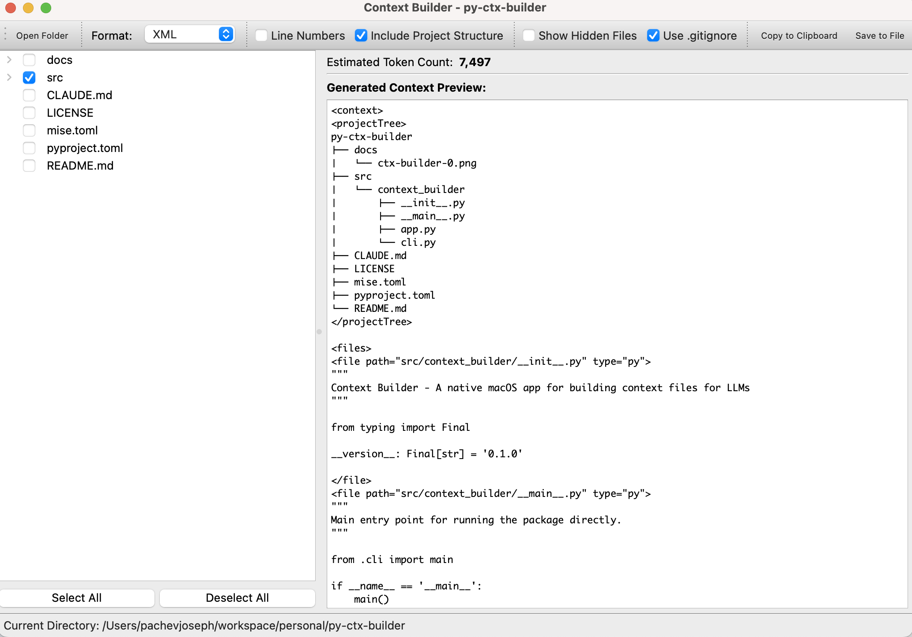

# Context Builder

A native macOS app for building context files for LLMs. This tool allows you to visually select files from your projects and generate formatted context documents suitable for prompting large language models. Largely inspired by [Simon Willison's files-to-prompt project](https://github.com/simonw/files-to-prompt/tree/main)



## Features

- File explorer with checkboxes for easy selection
- Support for different output formats (Plain text, XML, Markdown)
- Live preview with token counting
- Smart file filtering (respects .gitignore, filters by extension)
- Line number option
- Copy to clipboard and save to file functionality

## Installation

### Install from source

1. Clone the repository:
```bash
git clone https://github.com/pachev/context-builder
cd context-builder
```

2. Install using UV:
```bash
uv sync
```

3. Install the package in development mode:
```bash
uv pip install -e .
```

## Usage

### Command Line

Open the GUI for the current directory:

```bash
ctx-builder .
```

Or specify a different directory:

```bash
ctx-builder /path/to/project
```

### GUI Application

1. Open the application
2. Use the "Open Folder" button to select a project directory
3. Check the files you want to include in your context
4. Select your preferred output format (XML, Markdown)
5. Optionally enable line numbers
6. Use "Copy to Clipboard" or "Save to File" to export your context

## Format Options

- **Default**: Simple format with file paths and content separated by dashes
- **XML**: XML-ish format 
- **Markdown**: GitHub-flavored markdown with fenced code blocks

## Requirements

- Python 3.10+
- PyQt6
- Click

## License

Apache License 2.0
